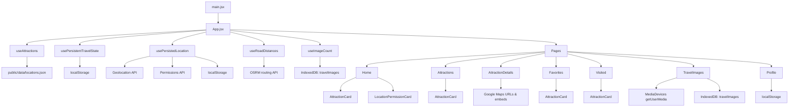
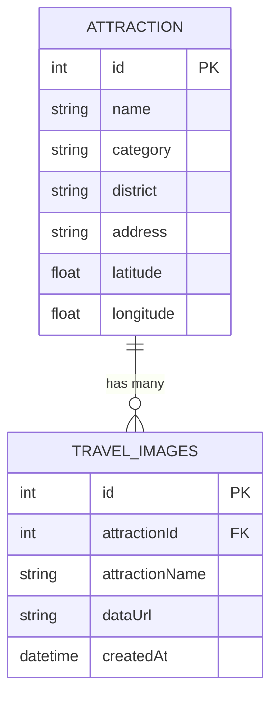

# Sri Lanka Travel Guide

A responsive, mobile-first React travel guide for discovering attractions across Sri Lanka. The app lets users browse places, filter by category, save favorites, track visited locations, preview maps and directions, calculate road distance from the user's location, and store travel photos locally in the browser.

## Highlights

- Browse attractions from a local JSON dataset.
- Search by attraction, district, category, address, or description.
- Filter by category and remember the last selected category.
- Save favorites and visited places in localStorage.
- Request geolocation and reuse the last saved location across tabs and browser restarts.
- Show road distance using a routing service instead of straight-line distance.
- Open Google Maps directions from the current location to an attraction.
- Capture travel photos from mobile cameras and laptop webcams.
- Store travel photos locally in IndexedDB.
- Maintain a local traveler profile with image, name, and bio.

## Tech Stack

- React 19
- Vite 7
- React Router 7
- Tailwind CSS 3
- Fetch API
- Geolocation API
- Permissions API
- MediaDevices
- LocalStorage
- IndexedDB
- Google Maps URLs and embeds
- OSRM public routing API for road distance

## Routes

| Route | Purpose |
| --- | --- |
| `/` | Home dashboard with featured places, quick categories, and current location card |
| `/attractions` | Search and category-based attraction browsing |
| `/attractions/:id` | Detailed attraction page with road distance, map, and directions |
| `/favorites` | Saved attractions |
| `/visited` | Visited attractions |
| `/travel-images` | Camera capture, image upload, local image gallery |
| `/profile` | Local traveler profile |

## Core Features

### 1. Attraction Discovery

Attraction data is loaded asynchronously from `public/data/locations.json` through the custom hook `src/hooks/useAttractions.js`. Each attraction includes a name, category, district, description, address, opening hours, coordinates, and image.

### 2. Location and Road Distance

The app requests geolocation only after user interaction. When the user grants permission:

- The current coordinates are saved in `localStorage`
- The saved location is reused across tabs and browser restarts
- The app checks browser permission changes with the Permissions API
- Attraction cards and detail pages show road distance.

Road distance is fetched through `src/utils/roadDistance.js` using OSRM's driving route endpoint and cached in `src/hooks/useRoadDistances.js`.

### 3. Maps and Directions

The app builds Google Maps URLs dynamically:

- If location exists, it opens driving directions from the saved user location
- If location is not available, it falls back to a normal attraction map preview

### 4. Travel Images

The travel image page supports two capture paths:

- Mobile browsers can use the file input camera flow
- Laptops and desktops can use an in-page webcam flow powered by `navigator.mediaDevices.getUserMedia()`

Captured or selected images are converted to data URLs and stored locally in IndexedDB. No image is uploaded to a server.

### 5. Persistent Local Data

Small user data is stored in `localStorage`:

- Traveler profile
- Favorite IDs
- Visited IDs
- Last selected category
- Last saved location

Travel photos are stored in IndexedDB because they are larger structured records.

## App Architecture




## IndexedDB ER Diagram




## Browser Storage

| Data | Storage | Notes |
| --- | --- | --- |
| Profile name, bio, image | LocalStorage | Lightweight user profile |
| Favorite attraction IDs | LocalStorage | Array of attraction IDs |
| Visited attraction IDs | LocalStorage | Array of attraction IDs |
| Last selected category | LocalStorage | Restores last filter |
| Last saved location | LocalStorage | Reused across tabs and sessions |
| Travel photos | IndexedDB | Persistent local image records |

Clearing site data removes these saved values.

## Project Structure

```text
public/
  data/locations.json
  images/
  _redirects
src/
  components/
  data/
  hooks/
  pages/
  utils/
  App.jsx
  index.css
  main.jsx
questions.md
fileguide.md
```

## Getting Started

### Requirements

- Node.js 20 or later
- npm
- A modern browser

### Install

```bash
git clone https://github.com/Rami2212/Sri-Lanka-Travel-Guide-React
cd Sri-Lanka-Travel-Guide-React
npm install
```

### Run in Development

```bash
npm run dev
```

### Build for Production

```bash
npm run build
```

### Run Lint

```bash
npm run lint
```

## Browser Compatibility Notes

Recommended browsers:

- Google Chrome
- Microsoft Edge
- Firefox
- Safari

Important behavior notes:

- `localStorage` and IndexedDB are required for persistence. If a browser is in strict private mode or storage is blocked, saved data may be limited.
- Geolocation permission is controlled by the browser. The app can remember the last saved location locally, but it cannot silently grant permission itself.
- The Permissions API is supported in most modern Chromium-based browsers. In browsers with partial support, the app still works, but permission-state updates may be less automatic.
- Mobile browsers often honor `capture="environment"` on file inputs and open the camera directly.
- Laptop and desktop browsers usually ignore the `capture` hint and open a file picker instead. That is why the app also includes a webcam-based `Open camera` flow using `getUserMedia()`.
- Webcam capture requires `navigator.mediaDevices.getUserMedia()` support and camera permission from the browser.
- Google Maps embeds and route-opening behavior depend on the browser allowing external map URLs and iframes.
- Road distance depends on network access to the OSRM public routing service. If that request fails, distance may show as unavailable.
